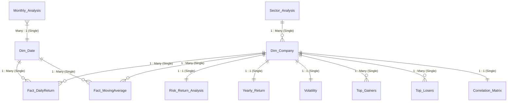

# Power BI Data Model Architecture & Schema Design

## Executive Summary
This document defines the relational data architecture, schema layout, table classifications, relationships, cardinality, cross-filtering rules, and key constraints for the **Data-Driven Stock Analysis Power BI Solution**.

The model is engineered using **Star Schema Principles** to maximize DAX calculation efficiency, optimize Power BI Desktop in-memory storage (VertiPaq engine), and guarantee seamless slicer propagation across all five dashboard report pages.

---

## 1. Schema Diagram (Mermaid Overview)

---

## 2. Table Classifications

### A. Core Dimension Tables
1. **`Dim_Company`** (Master Ticker Dimension):
   - **Role**: Primary conformed dimension driving stock selection across all pages.
   - **Primary Key**: `ticker`
   - **Attributes**: `ticker`, `company_name`, `sector`
   - **Source**: Extracted list of 50 unique Nifty 50 constituents mapped with standard sectors.

2. **`Dim_Date`** (Calendar Dimension):
   - **Role**: Conformed time-series dimension providing date filtering, drill-downs (Year, Quarter, Month, Day, Day of Week), and time intelligence functions.
   - **Primary Key**: `Date`
   - **Attributes**: `Date`, `Year`, `MonthNo`, `MonthName`, `Quarter`, `DayOfWeek`, `IsTradingDay`
   - **Date Range**: `2023-10-03` to `2024-11-25` (Matching fact dates).

### B. Core Fact Tables
1. **`Fact_DailyReturn`**:
   - **Role**: High-granularity transactional fact table capturing daily close price and daily return percentages.
   - **Foreign Keys**: `ticker` -> `Dim_Company[ticker]`, `trade_date` -> `Dim_Date[Date]`
   - **Measures**: `close_price`, `Daily_Return (%)`

2. **`Fact_MovingAverage`**:
   - **Role**: Technical indicator fact table storing calculated 20-day and 50-day moving averages alongside daily closing prices.
   - **Foreign Keys**: `ticker` -> `Dim_Company[ticker]`, `trade_date` -> `Dim_Date[Date]`
   - **Measures**: `close_price`, `MA20`, `MA50`

### C. Analytical & Summary Dimension Extensions
1. **`Risk_Return_Analysis`**:
   - **Foreign Key**: `ticker` -> `Dim_Company[ticker]` (1:1 Relationship)
   - **Attributes**: `Yearly_Return`, `Volatility`

2. **`Yearly_Return`**:
   - **Foreign Key**: `ticker` -> `Dim_Company[ticker]` (1:1 Relationship)
   - **Attributes**: `First Close`, `Last Close`, `Yearly Return (%)`

3. **`Volatility`**:
   - **Foreign Key**: `ticker` -> `Dim_Company[ticker]` (1:1 Relationship)
   - **Attributes**: `volatility`

4. **`Sector_Analysis`**:
   - **Primary Key**: `sector` -> `Dim_Company[sector]` (1:Many Relationship)
   - **Attributes**: `Companies`, `Average_Close`, `Average_Volume`

5. **`Monthly_Analysis`**:
   - **Foreign Key**: `month_number` -> `Dim_Date[MonthNo]` (Many:1 Relationship)
   - **Attributes**: `average_close_price`, `average_volume`

6. **`Top_Gainers` & `Top_Losers`**:
   - **Foreign Key**: `Ticker` -> `Dim_Company[ticker]` (Many:1 Relationship)

7. **`Correlation_Matrix`**:
   - **Primary Key**: `ticker` -> `Dim_Company[ticker]` (1:1 Relationship)

8. **`Market_Summary`**:
   - **Role**: Disconnected metadata table containing system summary metrics (`Total Records`, `Total Companies`, `Analysis Period`).

---

## 3. Comprehensive Model Relationship Table

| Primary Table (1 / Parent) | Primary Key Column | Foreign Table (* / Child) | Foreign Key Column | Cardinality | Cross-Filter Direction | Security Filtering | Description & Behavioral Rationale |
| :--- | :--- | :--- | :--- | :--- | :--- | :--- | :--- |
| `Dim_Company` | `ticker` | `Fact_DailyReturn` | `ticker` | One to Many (`1:*`) | Single (`Dim_Company` filters `Fact_DailyReturn`) | No | Slicing by Ticker or Sector filters daily returns. |
| `Dim_Company` | `ticker` | `Fact_MovingAverage` | `ticker` | One to Many (`1:*`) | Single (`Dim_Company` filters `Fact_MovingAverage`) | No | Slicing by Ticker filters moving average series. |
| `Dim_Date` | `Date` | `Fact_DailyReturn` | `trade_date` | One to Many (`1:*`) | Single (`Dim_Date` filters `Fact_DailyReturn`) | No | Filtering by Date range filters daily return records. |
| `Dim_Date` | `Date` | `Fact_MovingAverage` | `trade_date` | One to Many (`1:*`) | Single (`Dim_Date` filters `Fact_MovingAverage`) | No | Filtering by Date range filters technical MA values. |
| `Dim_Company` | `ticker` | `Risk_Return_Analysis` | `ticker` | One to One (`1:1`) | Both | No | Slicing company updates scatter plot; selection syncs bidirectionally. |
| `Dim_Company` | `ticker` | `Yearly_Return` | `ticker` | One to One (`1:1`) | Both | No | Connects annual performance summary directly to company dimension. |
| `Dim_Company` | `ticker` | `Volatility` | `ticker` | One to One (`1:1`) | Both | No | Connects standard deviation metrics directly to master ticker. |
| `Sector_Analysis` | `sector` | `Dim_Company` | `sector` | One to Many (`1:*`) | Single (`Sector_Analysis` filters `Dim_Company`) | No | Slicing by sector in sector page filters underlying companies. |
| `Dim_Company` | `ticker` | `Top_Gainers` | `Ticker` | One to Many (`1:*`) | Single | No | Ticker link for Top 10 leaderboards. |
| `Dim_Company` | `ticker` | `Top_Losers` | `Ticker` | One to Many (`1:*`) | Single | No | Ticker link for Top 10 loser leaderboards. |
| `Dim_Date` | `MonthNo` | `Monthly_Analysis` | `month_number` | One to Many (`1:*`) | Single | No | Connects monthly aggregate performance to Date dimension. |
| `Dim_Company` | `ticker` | `Correlation_Matrix` | `ticker` | One to One (`1:1`) | Both | No | Enables ticker-level highlight across correlation matrix. |

---

## 4. Key Best Practices & Optimization Notes

1. **Single-Direction Filtering by Default**:
   - Single cross-filtering (`1:*`) is strictly enforced between core Dimensions (`Dim_Company`, `Dim_Date`) and Fact tables (`Fact_DailyReturn`, `Fact_MovingAverage`). This prevents circular filter paths and performance degradation.

2. **Bidirectional Filters on 1:1 Dimension Extensions**:
   - Bi-directional cross-filtering is selectively enabled on `1:1` tables (`Risk_Return_Analysis`, `Yearly_Return`, `Volatility`, `Correlation_Matrix`) so selecting a ticker in any analytical chart immediately highlights its record across all visual representations.

3. **In-Memory Storage Optimization (VertiPaq)**:
   - High-cardinality unused columns (such as original row index `Unnamed: 0` in `volatility.csv`) are dropped during Power Query extraction to maximize compression efficiency.
   - Currency data types are mapped to `Fixed Decimal Number (Currency)` to ensure exact 4-decimal float precision without floating-point artifacts.
